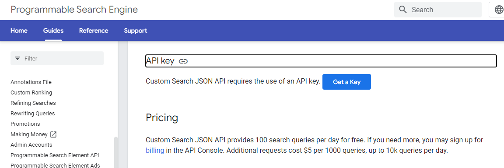

# Google Search

## Prompts

```
Find me three Chinese restaurants in Menlo Park, and get their menu’s from their website and tell me which one is the most affordable.
```

> Here are three Chinese restaurants in Menlo Park along with their menus:
>
> 1. Chef Chu's
>    Location: 1067 N San Antonio Rd, Los Altos, CA
>    Menu: Chef Chu's Menu
>    Sample Prices:
>    BBQ Pork Bun: $1.50
>    Vegetarian Style Pot Stickers (8): $6.95
>    Vegetarian Style Spring Rolls (3): $4.80
>    Curried Beef Puffs (8): $8.95
>
> 2. Tai Pan
>    Location: 560 Waverley Street, Palo Alto, CA
>    Menu: Tai Pan Menu
>    Sample Prices:
>    Dim Sum: Prices vary, typically around $5-$10 per item
>    Hong Kong Style Pan Fried Noodle with Peppered Beef: $15.95
>    Various entrees: $12-$20
>
> 3. The Mandarin
>    Location: 1029 El Camino Real, Menlo Park, CA
>    Menu: The Mandarin Menu
>    Sample Prices:
>    Deep Fried Prawns (6): $16.00
>    Egg Roll (4): $12.00
>    Pot Stickers (6): $16.00
>    Chicken Wings (6): $16.00
>
> Most Affordable Option
> Based on the sample prices provided:
>
> Chef Chu's appears to be the most affordable option with items like BBQ Pork Bun at $1.50 and Vegetarian Style Spring > Rolls at $4.80.
> The Mandarin and Tai Pan have higher prices for similar items, with most dishes ranging from $12 to $20.
> Therefore, Chef Chu's is the most affordable Chinese restaurant among the three.

## Authorization

The action `google_search` utilizes Google Custom Search API. The API usage requires the [API key](https://developers.google.com/custom-search/v1/overview#api_key) and
[search engine ID](https://programmablesearchengine.google.com/).

Follow these steps to obtain Google Custom Search API key:

1. Go to [Google Developer Console](https://developers.google.com/custom-search/v1/overview#api_key)
2. Click the `Get a Key` button
   
3. Select a existing Google project or create new project to which this key is attached to and click `Next`
   
4. Click the `SHOW KEY` button and copy the `YOUR API KEY` as `api_key` Secret.
   

Follow these steps to obtain Custom Search engine context key:

1. Go to [Programmable Search Engine](https://programmablesearchengine.google.com/) and click `Add` button.
2. Create a new search engine

   a. Give it a name, for example. "My Action Search Engine"

   b. Select `Search the entire web`

   c. Click the checkbox on `I'm not a robot`

3. Click `Create`

   

4. Click `Customize`

   

5. Copy the `Search engine ID` as `context` Secret

   

## Pricing

For details see https://developers.google.com/custom-search/v1/overview#pricing
