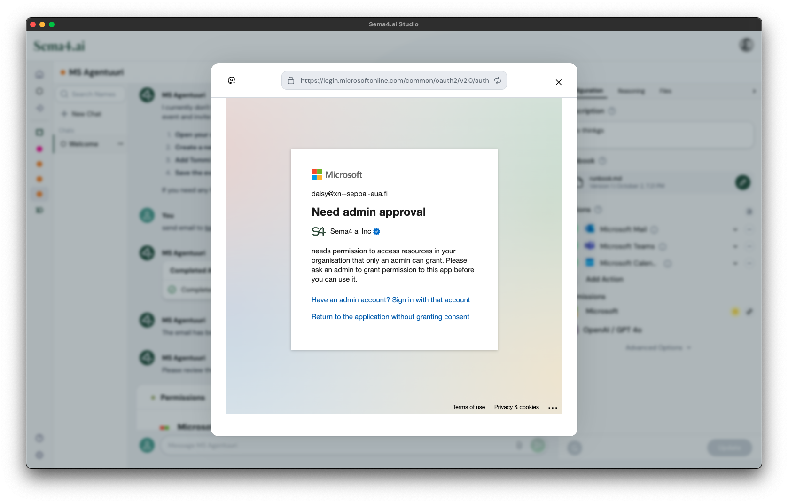
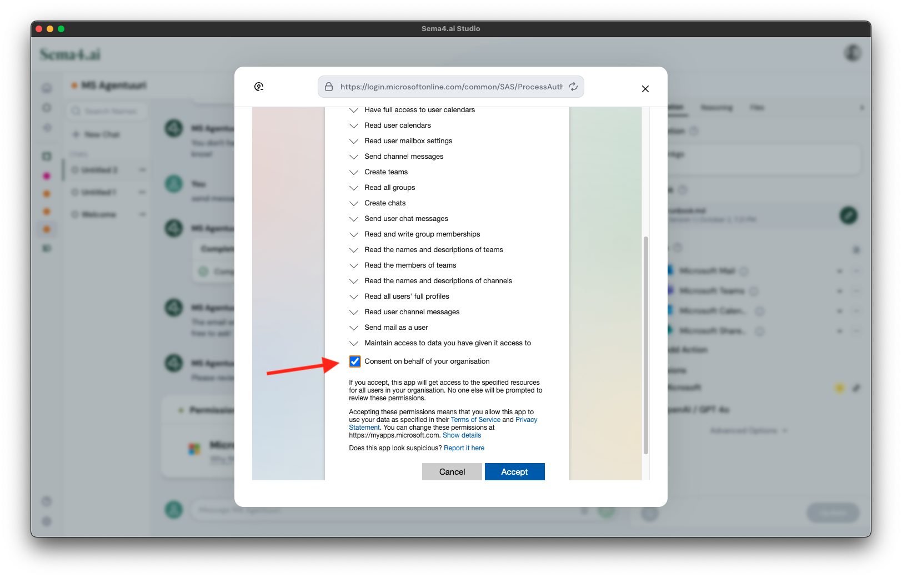

# Microsoft Teams

Action package for interaction with Microsoft Teams resources.

Currently capable of:

- **Listing the details of Teams that the user has joined.**
- **Searching for Teams by name.**
- **Listing members and channels of a Team.**
- **Searching for users.**
- **Posting messages in channels.**
- **Creating new Teams.**
- **Adding members to Teams.**
- **Creating one-on-one and group chats and sending messages to them.**
- **Getting messages from a specific channel.**
- **Getting replies to a specific message in a channel.**
- **Replying to a specific message in a channel.**

## Prompt Examples

```
Create a new chat with Tommi, and send a message "Yo, greetings from my Teams Agent!"
```

> A new chat has been created with Tommi, and the message "Yo, greetings from my Teams Agent!" has been sent.

```
Create a Team "Agent Testing"
```

> The team "Agent Testing" has been created successfully. If you need any further assistance, feel free to ask!

```
Post "Hello" to that team's general channel
```

> The message "Hello" has been posted to the General channel of the "Agent Testing" team. If you need any further assistance, feel free to ask!

## Authorization

> ⚠️ IMPORTANT  
> Microsoft Teams package requires organization administrator approval for part of the scopes it is using. Follow the instructions below carefully.

This package uses OAuth for user authenticaion. In Sema4.ai Studio you can either use the Sema4.ai provided public OAuth app credentials, or create your own client. In Control Room, you are expected to create the private client regardless. 

### Creating a Microsoft Entra Enterprise app for authentication

In order to use the action package you need to go into https://portal.azure.com and register new Azure Entra ID (formerly Azure AD) application. Follow the detailed instructions [here](https://sema4.ai/docs/build-agents/prebuilt-actions/authentication/microsoft).

Currently the Actions in this package use the following scopes.

    - Channel.ReadBasic.All
    - ChannelMessage.Send
    - ChannelMessage.Read.All
    - Chat.Create
    - ChatMessage.Send
    - Group.Read.All
    - GroupMember.ReadWrite.All
    - Team.Create
    - Team.ReadBasic.All
    - TeamMember.Read.All
    - User.Read.All


### Dealing with the admin consent

When using this Action Package from Sema4.ai Studio with the included public OAuth client application, the Teams package will require additional admin consent. And end user **without** administrator permissions will see this:



In this situation, please ask an admin user to install Sema4.ai Studio, and share them the same agent you have. Once an admin user proceeds to authenticate with their Microsoft account, they will see the following screen:



Once the administrator has checked the box for allowing organization user's to use the scopes, the regular user can log in again and the Teams package is fully functional.


