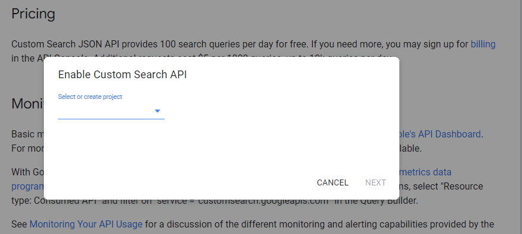
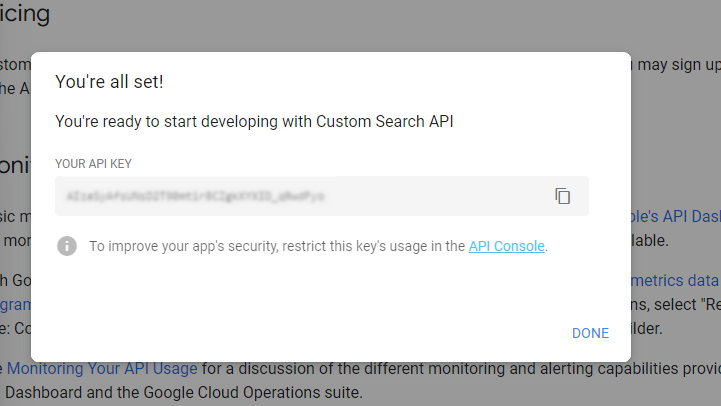
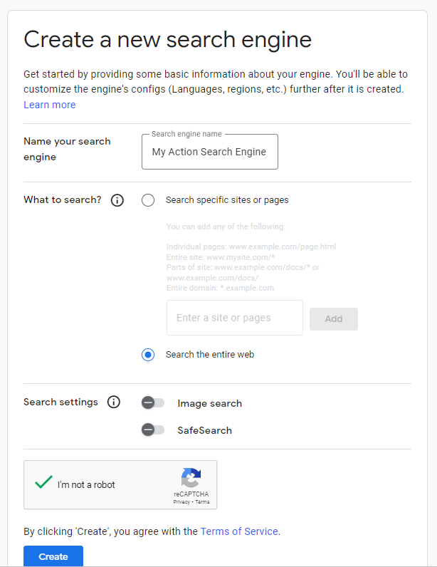
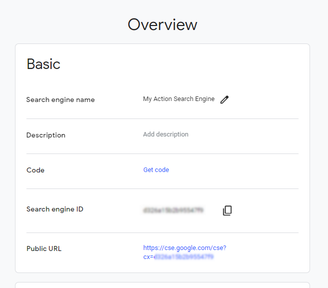

# Search and Browse

## Prompts

```
Find me three Chinese restaurants in Menlo Park, and get their menu’s from their website and tell me which one is the most affordable.
```

> I found three Chinese restaurants in the vicinity of Menlo Park. Here are their details and menus:
>
> 1. Chef Chu's
>
>    - Address: 1067 N San Antonio Rd, Los Altos, CA 94022-1323
>    - Phone: +1 650-948-2696
>    - Menu: Chef Chu's Menu
>    - Website: chefchu.com
>    - Chef Chu's offers a variety of traditional Chinese dishes.
>
> 2. Crouching Tiger Restaurant
>
>    - Address: 2644 Broadway Street, Redwood City, CA 94065
>    - Phone: +1 650-298-8881
>    - Menu: Dinner Menu, Lunch Menu
>    - Website: crouchingtigerrestaurant.com
>    - The restaurant is known for its Sichuan, Hunan, and Mandarin cuisine, with reasonable prices for dishes such as Dry Cooked Shrimp and Sweet & Sour Fish.
>
> 3. Tai Pan
>    - Address: 560 Waverley St, Palo Alto, CA 94301-1720
>    - Phone: +1 650-329-9168
>    - Menu: Dim Sum Menu, Dinner Menu
>    - Website: taipanpaloalto.com
>    - Tai Pan specializes in Hong Kong-style Cantonese cuisine including over 80 varieties of Dim Sum.

```
Find pharmacies in central Berlin Germany and return their street addresses and phone numbers.
```

> Here are some pharmacies in central Berlin along with their addresses and phone numbers:
>
> 1. MediosApotheke
>
>    - Address: Friedrichstraße 113A, Mitte, 10117 Berlin, Deutschland
>    - Phone: +49 30 2833530
>    - [Website](https://www.mediosapotheke.de/)
>
> 2. Neptun Apotheke
>
>    - Address: Dircksenstraße 2, Mitte, 10178 Berlin, Deutschland
>    - Phone: +49 30 24085443
>    - [Website](https://www.neptun-apotheke-berlin.de/)
>
> 3. Apotheke Quartier 205
>
>    - Address: Friedrichstraße 68, Mitte, 10117 Berlin, Germany
>    - Phone: +49 30 20945862
>    - [Website](https://www.apotheke-q205.de/)

## Authorization

The action `google_search` utilizes Google Custom Search API. The API usage requires the [API key](https://developers.google.com/custom-search/v1/overview#api_key) and
[search engine ID](https://programmablesearchengine.google.com/).

Follow these steps to obtain Google Custom Search API key:

1. Go to [Google Developer Console](https://developers.google.com/custom-search/v1/overview#api_key)
2. Click the `Get a Key` button
   
3. Select a existing Google project or create new project to which this key is attached to and click `Next`
   
4. Click the `SHOW KEY` button and copy the `YOUR API KEY` as `api_key` Secret.
   

Follow these steps to obtain Custom Search engine context key:

1. Go to [Programmable Search Engine](https://programmablesearchengine.google.com/) and click `Add` button.
2. Create a new search engine
   
   a. Give it a name, for example. "My Action Search Engine"
   
   b. Select `Search the entire web`
   
   c. Click the checkbox on `I'm not a robot`
   
3. Click `Create`

   

4. Click `Customize`

   

5. Copy the `Search engine ID` as `context` Secret

   

## Instruction for the Agent

```
You are a helpful assistant. Forward any text user has placed within quotes directly to the `google_search` action if that action is required.

Pass to `fill_elements` actions output from `get_website_content` embedded with the values to fill in correct elements.
```

## Actions

The following actions are contained with this package:

### download_file

Download file via URL to local filesystem.

### fill_elements

Fill elements and submit the form.

### get_website_content

Use 'playwright' browser to get information about the web page.

### google_search

Use Google Custom Search API to perform searches.

### web_search_news

Use DuckDuckGO API to search for news.

### web_search_places

Use DuckDuckGO API to use maps search for places.
