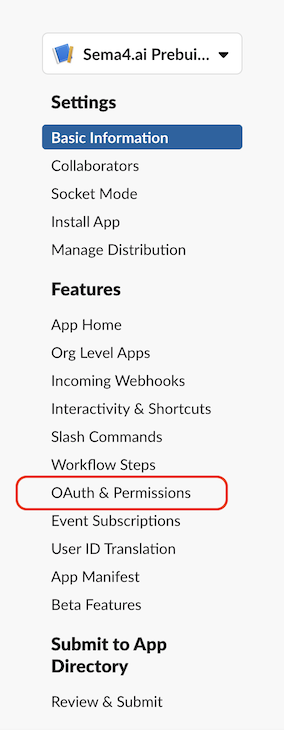
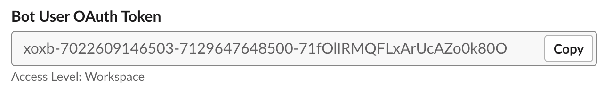
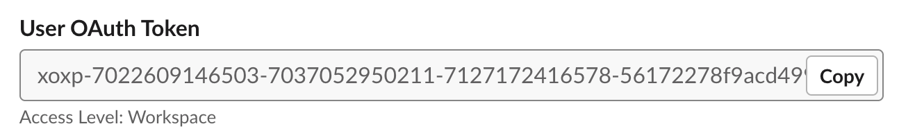

# Slack

Action Package interacting with Slack SDK.

It is currently capable of reading and writing to public channels.


## Authorization

In order to allow the AI Actions access to Slack it requires a "Slack Bot User OAuth Token". 
This is a non-refreshable private token associated with a Slack Application. 
In order to generate this token you need to create a Slack Application (with the appropriate OAuth scopes) and install the application in your Slack Workspace. 


## Types of Slack bots
Depending on your use case you can use one of two types of bots. 
1) **General purpose bot**.  
- This bot will have its own identity and it will behave like a separate user within the Slack workspace.   
- Messages posted by this bot will show as posted by the bot
- In order for the LLM to access different channels, it first needs to be added to that specific channel.
- It can not access private DMs however, it can access group chats as long as the bot is added to the group.
 
2) **"User Identity" bot**
- This bot will assume your identity when making calls to Slack
- Messages posted by this bot will show as posted by you.
- The bot will have access to all resources you have access to, including public and private channels, public and private groups and personal DMs 
- Since the bot shares your identity it does not need to be added to a channel before it can access the history of that channel.

## How to create a Slack Application and add it to your workspace.

1. Navigate to https://api.slack.com/apps. 
2. Login with your Slack account.
3. Click the "Create an App" button.
4. Select "From app manifest"
5. Select the workspace where you want to use the actions.   
6. Depending on the type of bot you wish to have (see [Types of Slack bots](#types-of-slack-bots)), copy-paste one of the following app manifest into the modal. This contains the name of app, the required permission scope and any optional settings you may like.  
For more info on app manifests visit: https://api.slack.com/concepts/manifests

### **General purpose bot**. 
```json
{
  "display_information": {
    "name": "Sema4.ai Prebuild Action"
  },
  "features": {
    "bot_user": {
      "display_name": "Sema4 Agent"
    }
  },
  "settings": {
    "org_deploy_enabled": false,
    "socket_mode_enabled": false,
    "is_hosted": false,
    "token_rotation_enabled": false
  },
  "oauth_config": {
    "scopes": {
      "bot": [
        "channels:history",
        "channels:read",
        "chat:write",
        "users:read"
      ]
    }
  }
}
```

### **"User Identity" bot**.
```json
{
    "display_information": {
        "name": "Sema4.ai Prebuild Action"
    },
    "settings": {
        "org_deploy_enabled": false,
        "socket_mode_enabled": false,
        "token_rotation_enabled": false
    },
    "oauth_config": {
        "scopes": {
            "user": [
                "channels:history",
                "channels:read",
                "chat:write",
                "groups:read",
                "im:read",
                "im:history",
                "mpim:read",
                "users:read"
            ]
        }
    }
}
```

**Note:** If you wish to support both a general purpose bot and a user bot withing the same application you can specify both scopes however, you can only use one token at a time when making requests to the Slack API.    
Example with both tokens:
```json
{
  "display_information": {
    "name": "Sema4.ai Prebuild Action"
  },
  "features": {
    "bot_user": {
      "display_name": "Sema4.ai Agent"
    }
  },
  "settings": {
    "org_deploy_enabled": false,
    "socket_mode_enabled": false,
    "is_hosted": false,
    "token_rotation_enabled": false
  },
  "oauth_config": {
    "scopes": {
      "bot": [
        "channels:history",
        "channels:read",
        "chat:write",
        "users:read"
      ],
      "user": [
        "channels:history",
        "channels:read",
        "chat:write",
        "groups:read",
        "im:read",
        "im:history",
        "mpim:read",
        "users:read"
      ]
    }
  }
}
```

7. Click "Create"
8. Click "Install to workspace". If you don't have the permission to install the app you will see a button labeled "Request to Install". By clicking it a notification will be sent to the workspace admin to install the app.
9. The OAuth window will pop up asking to authorise the application for the selected workspace. Click "Allow".
10. On the left sidebar, click on OAuth and Permissions, this will redirect you to a page with the access token.  

12. You can now see the access token:
- For **General purpose bot** you will need to use the `Bot User OAuth Token`

- For **"User Identity" bot** you will need to use the `User OAuth Token`

## Prompt Examples

``` Fetch the last 10 Slack messages from general. ```


> Here are the last 10 messages from the "general" channel:
> 1. **Jane Doe** - Happy to be part of John's demo - May 8, 2024
> 2. **Jane Doe** - :wave: Hi everyone! - May 8, 2024
> 3. **Jane Doe** - <@U0735UVTUPJ> has joined the channel - May 8, 2024
> 4. **Sema4.ai Premade Actions** - primis in faucibus- May 8, 2024
> 5. **Sema4.ai Premade Actions** - fames ac ante ipsum - May 8, 2024
> 6. **Sema4.ai Premade Actions** - Interdum et malesuada - May 8, 2024
> 7. **Sema4.ai Premade Actions** - Pellentesque in velit neque - May 7, 2024
> 8. **John  Doe** - consectetur adipiscing elit. - May 7, 2024
> 9. **John  Doe** - ...dolor sit amet, - May 7, 2024
> 10. **Sema4.ai Premade Actions** - Lorem ipsum... - May 7, 2024
> ? If you need more information or assistance, feel free to ask!


``` Create a table from those messages containing the date in human-readable format and a column for bot messages.```

>Here is a table created from the messages with the date in human-readable format and a column indicating bot messages:
>
>| User          | Message                        | Date                | Bot Message |
>|---------------|--------------------------------|---------------------|-------------|
>| Jane Doe        | Happy to be part of John's demo | May 8, 2024 09:51 AM | No          |
>| Jane Doe        | :wave: Hi everyone!            | May 8, 2024 09:51 AM | No          |
>| Jane Doe        | <@U0735UVTUPJ> has joined the channel | May 8, 2024 09:50 AM | No          |
>| Sema4.ai Premade Actions | primis in faucibus             | May 8, 2024 09:35 AM | Yes         |
>| Sema4.ai Premade Actions | fames ac ante ipsum                     | May 8, 2024 09:08 AM | Yes         |
>| Sema4.ai Premade Actions | Interdum et malesuada                   | May 8, 2024 08:54 AM | Yes         |
>| Sema4.ai Premade Actions | Pellentesque in velit neque                  | May 7, 2024 12:26 PM | Yes         |
>| John  Doe | consectetur adipiscing elit.             | May 7, 2024 09:21 AM | No          |
>| John  Doe | ...dolor sit amet,          | May 7, 2024 09:21 AM | No          |
>| Sema4.ai Premade Actions | Lorem ipsum...                 | May 7, 2024 09:14 AM | Yes         |


``` Post the table to general ```


> The table has been successfully posted to the "general" channel.


## Caveats
- In order for the action to read the messages from a channel the bot associated with your Slack Application needs to be added to the channel.  
- In order to accommodate smaller models and/or allow parsing bigger responses when reading from channels, we remove the following fields from the Slack payload: `blocks` and `bot_profile`
- While technically the action can read (with the appropriate OAuth scopes) DMs, private and public groups and channels, that functionality has not been properly validated yet. 
