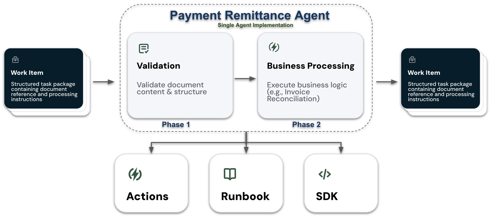
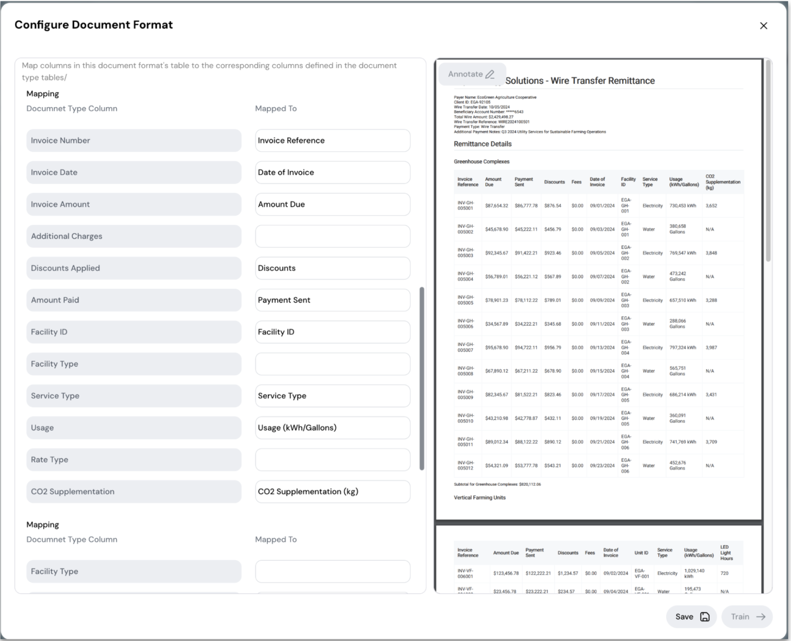
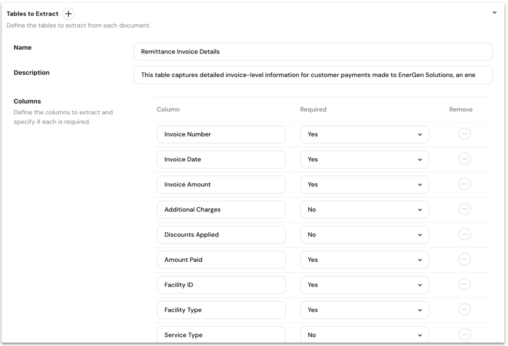
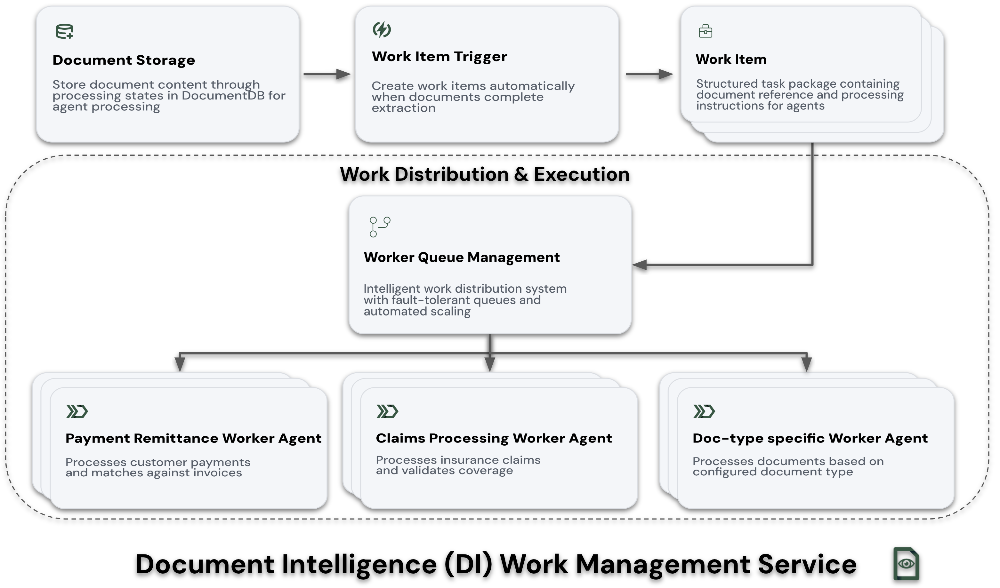
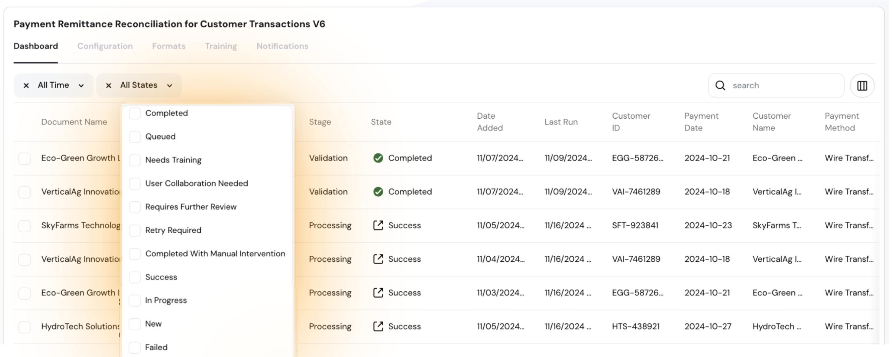

# Payment Remittance Agent

The Payment Remittance Agent is Sema4.ai's showcase Worker Agent that demonstrates how Document Intelligence transforms complex document-centric work from manual effort into autonomous processes. This reference implementation illustrates how enterprises can automate sophisticated validation and reconciliation workflows while maintaining precise control over their processes.



## Overview 

Many organizations face significant challenges processing and reconciling high volumes of customer payments, especially when dealing with various payment methods and complex remittance information. The Payment Remittance Agent showcases how Document Intelligence can:

- Process thousands of payments monthly for enterprise organizations
- Transform manual reconciliation tasks from hours to seconds  
- Handle complex multi-level reconciliation with precision
- Intelligently escalate to human experts when needed

### Real-World Use Case: AquaEnergy Solutions

To illustrate the power of autonomous document processing, consider AquaEnergy Solutions, a mid-sized utility service provider that:

- Processes thousands of payments monthly from diverse customers
- Handles multiple payment methods (ACH, wire transfers, consolidated payments)  
- Manages complex invoices across electricity, water, and gas services
- Needs to match payments against open receivables quickly and accurately
- Must handle varying remittance document formats based on payment type



What previously took hours of manual effort, Document Intelligence transforms into an automated workflow completed in seconds.

## Architecture

The Payment Remittance Agent implements a unified single-agent architecture that handles both validation and reconciliation phases within a single Worker Agent:

```
payment-remittance-agent/
├── actions/MyActions/
│   ├── payment-remittance-notification-actions/  # Notification handling
│   ├── payment-remittance-reconcile-actions/     # Reconciliation logic  
│   └── payment-remittance-validate-actions/      # Validation processing
├── img/                                          # Documentation images
└── runbook.md                                    # Agent processing logic
```

### Key Components

The agent operates through two sequential phases:

#### Phase 1: Document Validation
- Ensures document integrity and accuracy before processing
- Performs comprehensive validation of structure and content
- Generates detailed validation reports
- Controls transition to reconciliation phase

#### Phase 2: Payment Reconciliation  
- Executes sophisticated multi-level payment analysis
- Validates against AR records at payment and line-item levels
- Detects and analyzes discrepancies  
- Determines when human collaboration is needed



## Core Capabilities

### Autonomous Processing
- Independently handles standard reconciliation cases
- Provides real-time status updates and progress tracking
- Generates comprehensive processing reports at each stage

### Multi-Level Analysis
- Payment level validation and matching
- Facility level aggregation and verification  
- Individual invoice reconciliation
- Sophisticated discrepancy detection

### Intelligent Collaboration
- Automatically processes standard cases
- Escalates complex discrepancies with full context
- Maintains processing state during collaboration
- Provides detailed analysis for expert review

## Intelligent Work Management

The Payment Remittance Agent integrates deeply with Sema4.ai's Intelligent Work Management service, which orchestrates document processing through well-defined states and collaboration workflows.

### Service Architecture



The architecture shows how Worker Agents like the Payment Remittance Agent interact with core Work Management components to enable autonomous document processing with intelligent human collaboration.

### Key Components & Concepts

#### Worker Agent
- Autonomous software entity designed to process Work Items
- Executes predefined business logic through runbooks
- Operates asynchronously and scales horizontally
- Knows exactly when to engage human expertise
- Maintains processing context across state transitions

#### Work Item
- Discrete unit of work encapsulating document data
- Directly tied to a single Document and Document Type
- Tracks complete processing lifecycle
- Maintains processing context and history
- Enables state-based workflow management

#### Work Queue Management
- Manages ordered collections of Work Items
- Enables asynchronous and decoupled processing
- Supports parallel processing with concurrency control
- Implements automatic retry mechanisms for failures
- Provides monitoring and metrics for queue status

#### Work Item Triggers
- Automatic creation from validated documents
- Event-driven processing initiation
- State-based workflow progression
- Collaboration workflow activation
- Resolution path determination

### Work Item Lifecycle



Work Items flow through multiple services and states throughout their lifecycle:

#### Extraction Service States
- **New**: Document detected and ready for processing
- **Queued**: Awaiting extraction resources
- **Extraction in Progress**: Active data extraction
- **Extraction Complete**: Structured data ready
- **Extraction Failed**: Processing errors detected

#### Work Management Service States
- **Validation in Progress**: Business rule verification
- **Validation Failed**: Rule violations detected
- **Processing in Progress**: Agent executing business logic
- **Processing Complete**: Successful autonomous completion
- **User Collaboration Needed**: Expert input required
- **Completed with Manual Intervention**: Human-guided resolution
- **Requires Further Review**: Additional analysis needed

### Processing Workflows

The Payment Remittance Agent handles several standard processing flows:

1. **Standard Processing Flow**
   - Document extraction completed
   - Validation checks passed
   - Reconciliation executed
   - Processing completed autonomously

2. **Exception Handling Flow**
   - Discrepancy detected
   - Expert collaboration initiated
   - Context prepared and shared
   - Resolution path determined
   - Final state recorded

3. **Recovery Flow**
   - System issues detected
   - Automatic retry attempted
   - Error context captured
   - Resolution path selected

### Collaboration Capabilities

When human expertise is needed, the agent:
- Provides rich processing context
- Maintains state during collaboration
- Captures resolution decisions 
- Updates status based on outcomes

This integration with Intelligent Work Management enables the Payment Remittance Agent to:
- Handle high volumes of documents autonomously
- Engage human expertise precisely when needed
- Maintain processing visibility and control
- Ensure complete process auditability

Through this architecture, the Payment Remittance Agent demonstrates how Document Intelligence transforms complex document-centric work into efficient, automated workflows while maintaining precise control and visibility throughout the process.

## Document Lifecycle & DI Service Integration

### Document States
The agent integrates with Document Intelligence Service to manage document state transitions:

1. **New**: Document uploaded for processing
2. **Validation**: Document undergoing integrity checks
3. **Reconciliation**: Payment matching and analysis in progress  
4. **Complete**: Successfully processed
5. **Exception**: Manual review required

### Service Integration
```python
# Retrieve work item from DI Service
@action
def get_remittance_work_item(remittance_id: str) -> DocumentWorkItem:
    """
    Retrieve work item for processing.
    Args:
        remittance_id (str): Document ID from DI Service
    Returns:
        DocumentWorkItem: Contains document details and state
    """
    doc_intel_client = create_di_client()
    return doc_intel_client.get_document_work_item(remittance_id)
```

### Content State Management
The agent works with various document content states:
```python
# Get validated content for processing
content = di_client.get_document_content(
    document_id,
    ContentState.COMPUTED
)

# Update work item status 
di_client.work_items_complete_stage(
    work_item_id,
    "SUCCESS",
    "Processing completed successfully",
    detailed_report
)
```

## Validation Rules

Core validation checks include:

### 1. Invoice Count Validation
```python 
def validate_invoice_count(self, content: Dict) -> ValidationResult:
    """Verify total invoice count matches line items."""
    stated_count = int(content['fields']['Total Invoices'])
    actual_count = len(content['invoice_details'])
    
    return ValidationResult(
        passed=(stated_count == actual_count),
        difference=abs(stated_count - actual_count)
    )
```

### 2. Facility Type Subtotal Validation
```python
def validate_facility_subtotals(self, content: Dict) -> ValidationResult:
    """Verify facility type subtotals match sum of invoices."""
    for facility_type, subtotal in content['summary']:
        calculated_total = self._calculate_facility_total(
            content['invoice_details'], 
            facility_type
        )
        if abs(subtotal - calculated_total) > self.threshold:
            return ValidationResult(
                passed=False,
                difference=abs(subtotal - calculated_total)
            )
```

### 3. Total Payment Amount Validation
```python
def validate_total_payment(self, content: Dict) -> ValidationResult:
    """Verify total payment matches sum of invoice payments."""
    stated_total = self._parse_monetary_value(
        content['fields']['Total Payment Paid']
    )
    calculated_total = self._calculate_total_payments(
        content['invoice_details']
    )
    
    return ValidationResult(
        passed=abs(stated_total - calculated_total) <= self.threshold,
        difference=abs(stated_total - calculated_total)
    )
```

## Reports

The agent generates detailed reports for both successful and failed processing:

### Success Report
```markdown
# Validation Report

**Status**: SUCCESS
**Document**: FirstRite Agriculture Association - Wire Transfer Payment.pdf
**Timestamp**: 2024-10-22T14:30:27.891234

## Results
- All validation checks passed
- Processed invoices: 42
- Total amount: $2,636,905.41

## Validation Metrics
- Field completion: 100%
- Numeric precision: 100%  
- Business rule compliance: 100%
```

### Failure Report
```markdown
# Validation Report

**Status**: FAILURE
**Document**: FirstRite Agriculture Association - Wire Transfer Payment.pdf
**Timestamp**: 2024-10-22T14:30:27.891234

## Failed Validations
1. Facility Type Subtotals
   - Expected: $820,112.06
   - Calculated: $828,396.12
   - Difference: $8,284.06

2. Total Payment
   - Expected: $2,636,905.41
   - Calculated: $2,645,189.47
   - Difference: $8,284.06

## Impact Assessment  
- Material difference detected
- Affects: Greenhouse Complexes facility type
- 0.31% total payment variance  
```

## Getting Started

To experience the Payment Remittance Agent:

1. [Request access to Sema4.ai Studio](https://sema4.ai/try-studio/)  
2. Deploy the agent using Studio's Try Now feature
3. Create work items from pre-processed documents
4. Watch autonomous validation and reconciliation in action
5. Experience how agents handle both successful processing and discrepancies

For detailed guidance, refer to the [Document Intelligence documentation](https://sema4.ai/docs/solutions/meet-document-intelligence).
