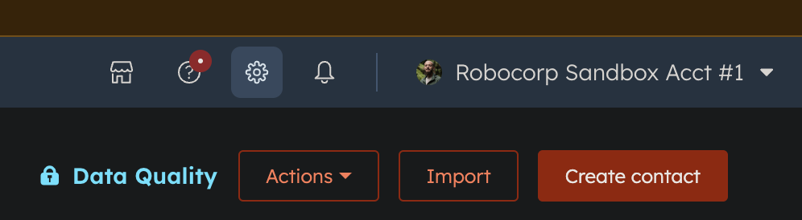
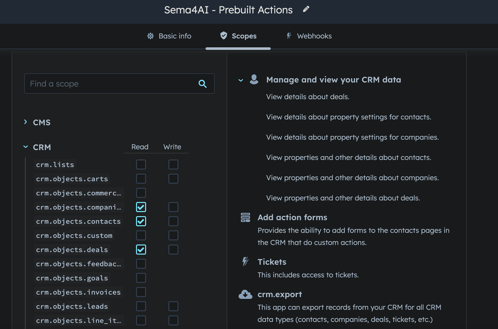
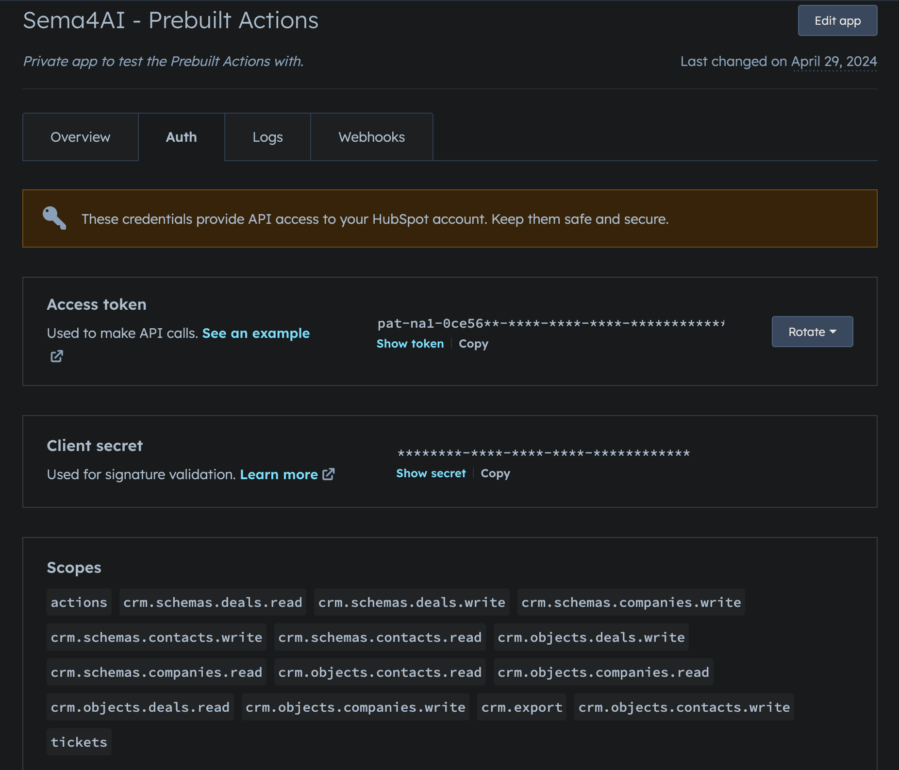

# HubSpot

Action Package interacting with HubSpot resources.

It is currently capable of searching for and retrieving CRM objects like companies, contacts, deals etc. The search is relying on a basic query string matched against all the properties, while the returned results can be limited.

## Prompts

```
Hey, please tell me what companies we have in HubSpot matching "AI".
```

> Here are the companies in HubSpot matching "AI":
> 1. Fireflies.ai
> 2. substorm.ai
> 3. sp.ai

```
Now, please give me a contact for the first company listed previously.
```

> The contact for Fireflies.ai listed in HubSpot is:
>
> * Name: Fireflies.ai Notetaker
> * Email: fred@fireflies.ai

```
Show me the tasks in HubSpot matching "prebuilt" and list them by priority please.
```

> I found 2 tasks in HubSpot matching "prebuilt" and here they are listed by priority:
>
> 1. Prebuilt Actions - README test
>    * Priority: HIGH
>    * Status: NOT_STARTED
>    * Type: TODO
>    * Created Date: 2024-05-08
>    * Description: This is high prio!
> 2. Prebuilt Action task
>    * Priority: MEDIUM
>    * Status: NOT_STARTED
>    * Type: CALL
>    * Created Date: 2024-04-29
>    * Description: Hey, please take this task and sort it out so it is shown in our Prebuilt Action searching capability.

## Authorization

In order to allow the AI Actions access your resources, you need to supply a mandatory secret called the "access token".  
This is a long-lived stable token that once generated, never expires, and it should be kept safe and rotated in case it gets leaked. Compared to an API key, this token is tied to a Private App that you need to create and generate the token with.

Follow these steps to obtain a suitable access token:

1. Go to [HubSpot](https://app.hubspot.com/) and select the account you want to give the actions access into.
2. Click the cog button on the top-right side of the menu bar to get into "Settings" menu.
   
3. From the left side pane, go to "Integrations" -> "Private Apps" and create such app.
4. Make sure to add the required scopes. These represent the permissions you give to the actions when operating over the resources.  
   At least the following permissions are required (used pipe `|` for simplicity):
   - `crm.objects|schemas.companies|contacts|deals.read`, `crm.export`
   - `tickets`
   - `actions`

   
5. With the app created and sufficient scopes set in, you can now retrieve the generated access token and use it in the UI during the action deployment.
   

## Caveats

- The search is quite basic, not supporting yet complex queries, nor filtering and sorting the results.
- The set of actions is currently limited to read-only operations, although it's on the roadmap to enable a broader use, like creating/updating and deleting objects as well.
- The actions are currently supporting the following object types only:
  - CRM: companies, contacts, deals, tickets, tasks
